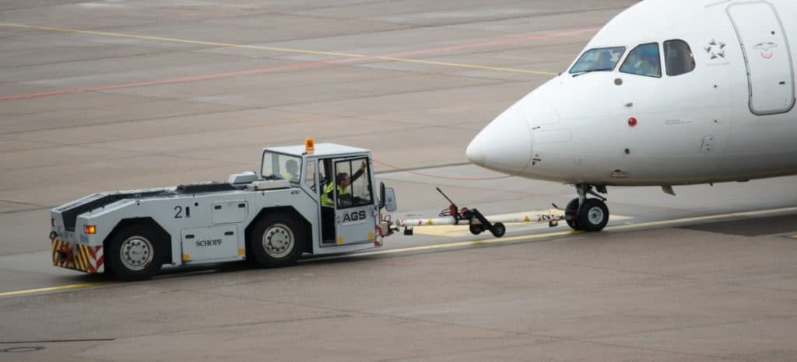
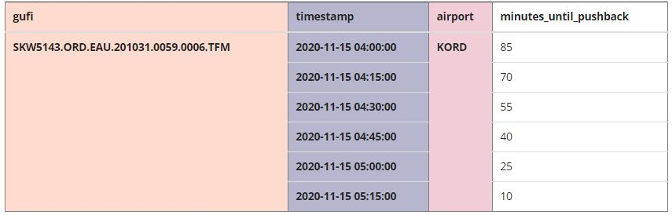
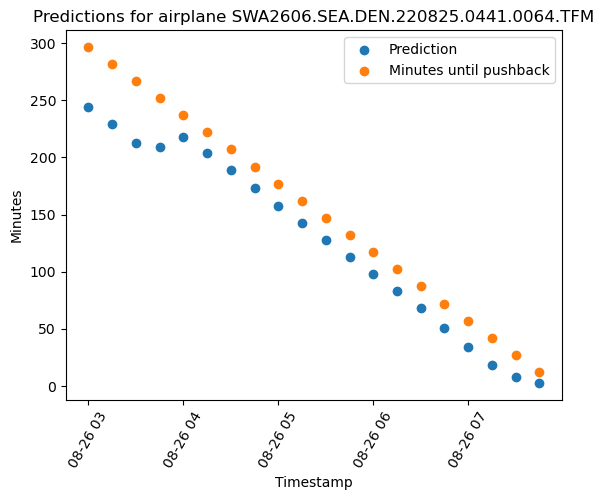
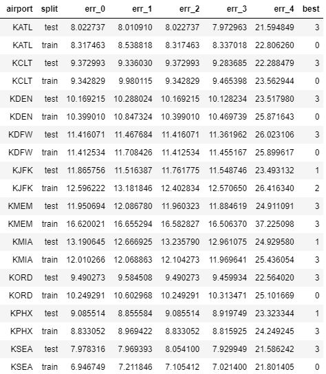
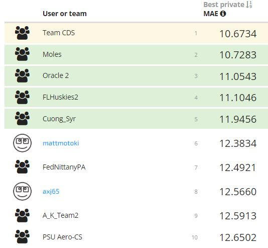
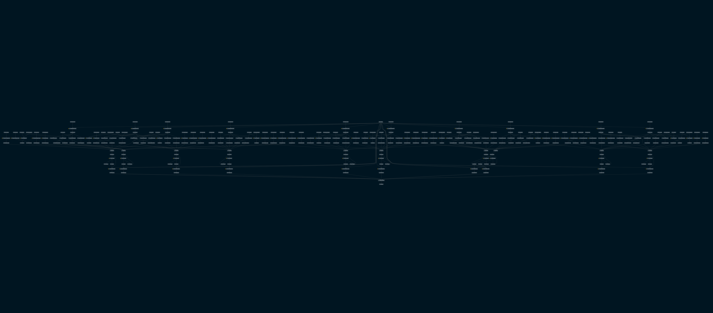

<!-- PROJECT LOGO -->
<br />
<div align="center">
  
  <h3 align="center"> NASA Pushback competition: Predict minutes until pushback time </h3>

  <p align="center">
    CDS team repository to develop the models and serve the prediction functionalities for the 2023 NASA Pushback challenge 
    <br />
    <a href="https://www.drivendata.org/competitions/149/competition-nasa-airport-pushback/page/676/"><strong>Visit competition site »</strong></a>
  </p>
</div>


<!-- TABLE OF CONTENTS -->
## Table of contents
  <ol>
    <li> <a href="#context-of-the-challenge">Context of the challenge</a> </li>
    <li><a href="#approach-of-our-solution">Approach of our solution</a></li>
    <li><a href="#results-obtained">Results obtained</a></li>
    <li><a href="#repository-structure">Repository structure</a></li>
    <li><a href="#usage">Usage</a></li>
     <ul>
        <li><a href="#prerequisites">Prerequisites</a></li>
        <li><a href="#execution">Execution</a></li>
      </ul>
    <li><a href="#acknowledgments">Acknowledgments</a></li>
  </ol>


<!-- CONTEXT -->
## Context of the challenge

<div align="justify">

Every year millions of flights arrive and depart from US airports. Intelligent scheduling and system control is a very pressing problem. Knowing in advance or accurately forecasting the pushback moment for departure is one of the key inputs to arrange optimized schedules. With the surge of Big Data and Advanced Analytics techniques most of these forecasts are based on Machine Learning methods.

In this 2023 analytics case competition, NASA partnered with DrivenData to facilitate real-world data to develop these types of models and suggest alternative approaches to the existing research.

More precisely, participants in this challenge were given the task to build an Advanced Analytics model capable of forecasting the minutes until pushback at an airplane and timestamp level for 10 US airports.

A graphical representation of the desired output by the model can be observed below as a grid crossing airports, timestamps and minutes until pushback:



<!-- APPROACH -->
## Approach of our solution

In order to tackle the 2023 NASA challenge and accurately predict the minutes until pushback for each pair of airplane-timestamp, we have followed the following sequential steps:

- Analyzed and cleansed the raw data provided by NASA - 11 sources comprising data from weather, estimated departure times, traffic flow management, and others
- Extracted 298 explanatory features at the gufi-timestamp level
- Trained 4 families of models
  - V0: One model per airport predicting minutes until pushback minus estimated time of departure
  - V1: One model per airport predicting minutes until pushback
  - V2: Same as V0 with some parameter changes
  - Global model: Single model trained to predict minutes until pushback for all airports (with airport string as an input variable)
- Fine tuned the parameters for each model and designed the ensembling architecture that minimized MAE in a held-out validation sample
- Built the necessary functionalities to serve predictions in real-time within NASA's containerized environment

<!-- RESULTS -->
## Results obtained

This challenge's results are assessed based on the mean absolute error of the predictions. For instance, below we can observe the ground-truth against the predicted minutes until pushback for a particular airplane at different timestamps:



As one can observe, for some timestamps we are more accurate than others. Averaging across all airplanes and timestamps in the last four available months (2022-09, 2022-10, 2022-11, and 2022-12), stored as test set unseen during the training period, we observe the following error contrast between different methods: 




Now comparing our solution with the other participants, we observe that we were able to finish in first position of the leaderboard of the competition:



<!-- REPOSITORY -->
## Repository structure

Below one can observe the repository structure of the solution. It is divided into *training* (functionalities to extract features and train the models) and *submission* (functionalities to serve prediction in NASA's runtime environment).

```
NASA-pushback
│   README.md
└───images
└───requirements.txt
└───training
│   └───conf
│   └───docs
│   └───logs
│   └───data
│       └───01_raw
│           └───KATL
│           └───KCLT
│           └───KDEN
│           └───KDFW
│           └───KJFK
│           └───KMEM
│           └───KMIA
│           └───KORD
│           └───KPHX
│           └───KSEA
│       └───02_intermediate
│       └───03_primary
│       └───04_feature
│       └───05_model_input
│       └───06_models
│       └───07_model_output
│       └───08_reporting
│   └───notebooks
│   └───src
│       └───tests
│       └───pushback-nasa
│   
└───sumbission
│   │   solution.py
│   │   config.py
│   │   utilities.py
│   └───models
│   └───submission.zip
```

<!-- USAGE -->
## Usage

In this section we discuss how to use the repository to build the model artifacts, and generate predictions for new, unseen data. 

### Prerequisites

Before executing the code, the following are key prerequisites to  set-up:

- Python version > 3.8
- Packages and dependencies from *requirements.txt* installed
- 32Gb of CPU RAM or more available
- Raw data sources (config, etd, runways, standtimes,...) in CSV format located in the directory training/data/01_raw/ organized by airport as detailed in the repository structure

### Execution

Once the requisites from above are met, the training pipeline can be triggered by running the following command from the /training directory:

```python 
$ kedro run 
```

Alternatively, the different pipelines can be run sequentially as:

```python 
$ kedro run --pipeline create_targets
$ kedro run --pipeline feature_extraction
$ kedro run --pipeline create_master
$ kedro run --pipeline train_models
$ kedro run --pipeline generate_predictions
```

And once the model artifacts are stored, the submission module can be called to generate inferences on unseen data as specified below. This is of particular relevance for the competition scoring since it takes place in the abstracted NASA runtime environment.
  
```python 
$ python3 solution.py 
```

In order to visualize the dependencies and the code execution path one can run the kedro viz command to see the following in an interactive browser prompt:



<!-- ACKNOWLEDGMENTS -->
## Acknowledgments

We would like to place on record our deepest sense of gratitude towards NASA and DrivenData for organizing and hosting this competition respectively. 

</div>
