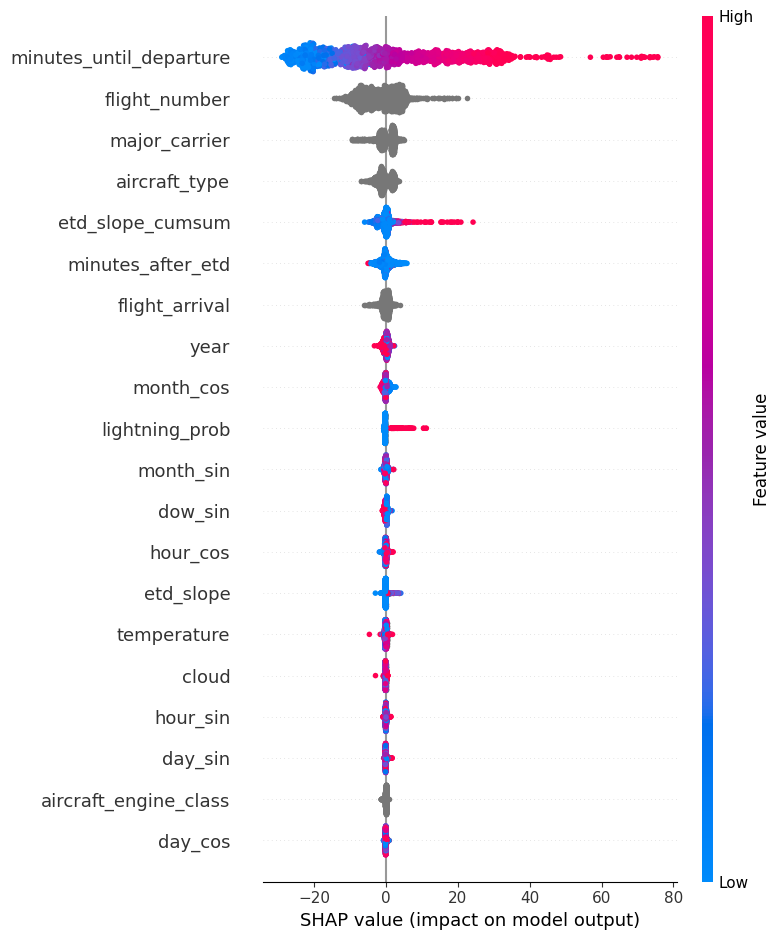

# Solution - NASA Pushback to the Future Competition

Caltech "Moles" team respository for predicting pushback times at US airports.

[Competition website &rarr;](https://www.drivendata.org/competitions/182/competition-nasa-airport-pushback-prescreened/page/712/)

## Overview
This repository contains code to create and execute a model to predict pushback time (defined as the time between when an airplane arives at and departs from the gate) as specified by the 2023 NASA Pushback to the Future Competition. Given provided data from ten US airports, a CatBoost model is trained separately on each airport following data cleansing and feature extraction. 

## Repository Structure
This repository contains separate pipelines for model training and inference. Trained models are stored in the "models" folder.

```
nasa-pushback-competition
├── README.md
├── data ------------------> holds raw data
├── model -----------------> holds trained model
├── requirements.txt ------> lists requirements
├── setup.py --------------> makes project pip installable
└── src
    ├── __init__.py
    ├── config.py ---------> path configuration
    ├── make_dataset.py ---> runs feature extraction
    ├── run_inference.py --> pipeline for making predictions
    ├── run_training.py ---> pipeline for training model
    └── utils.py ----------> helper functions used for inference
```

## Setup

Create and activate virtual environment:
```
python3 -m venv venv
source venv/bin/activate
```

Install the required python packages:
```
pip install -r requirements.txt
```

If using a different directory structure, update config.py file with the desired data and model paths.

## Hardware

Machine specs and time we used to run our model

* CPU: 2 vCPU
* GPU: N/A
* Memory: 25 GB
* OS: Ubuntu
* Train duration: 6 hours
* Inference duration: 15 minutes on the full provided dataset


## Run training

Execute feature extraction and model training pipeline:
```
python src/run_training.py
```

## Run inference

Generate predictions for sample submission format:
```
python src/run_inference.py
```

## Results

The model achieved a mean absolute error of 10.7283 on the private validation dataset and scored 2nd in the competition. A chart of the model's feature importances (SHAP values) is shown below.

<center></center>

## Authors

[@Brian Hu](https://github.com/BrainHu42)
[@Nika Chuzhoy](https://github.com/nikac776)
